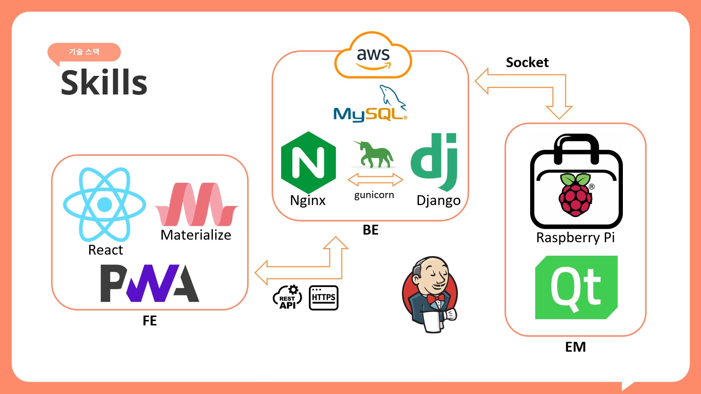

# [MyYak](https://lab.ssafy.com/s10-webmobile3-sub2/S10P12A201)

## 프로젝트 개요

# [MyYak](https://lab.ssafy.com/s10-webmobile3-sub2/S10P12A201)

## 팀원

|||
|:-:|:-:|
|[김준하](https://github.com/kimjunha1575)|[오동현](https://github.com/ODong-Dong)|
|||
|[유승호](https://github.com/MUYAHOYA)|[윤동휘](https://github.com/YUNDONGHWI)|
|||
|[이연우(팀장)](https://github.com/dusdn0224)|[황성재](https://github.com/lacoon2874)|

## 서비스 개요

구급함에 넣어둔 약들의 데이터를 가지고 있어, 필요 시 증상에 따라 바로 필요한 약을 찾을 수 있게 도와주는 IoT 약 상자

## **서비스 대상**

- 가정용 구급함 및 상비약품 관리에 어려움과 귀찮음을 느끼는 일반 소비자
- 원격으로 피부양자의 약을 관리해드리고 싶은 기특한 부양자들

## **주요 기능**

### **구급함 자체 기능**

- 약 보관 기능
- 자동 open, close
- 위치 알림기능 (어떤 칸에 뭐있는지)
- 해당 약 복용량 안내

---

### **웹(앱) 기능**

- 회원 관리
    - 로그인, 로그아웃, 회원정보 수정
    - 기기 등록 
- 가지고 있는 약 데이터 보관
    - 소비기한 데이터
- 근처 약국 및 상비약 구매가능, 편의점 안내기능 → 네이버 지역검색 api or 카카오지도 api
    - 기본적으로 약국만 검색
- 증상 입력 및 그에 맞는 소지하고 있는 약 확인 기능
- 적정 복용량 안내 기능

---

## 🐥**파트 별 구현기능**

### 임베디드

- 약통(가로280*세로345*높이245) → 서랍(가로127*세로318*높이49)cm
- 약칸이 자동개폐 (모터 이용)
- 디스플레이를 통한 사용자 UI
- 와이파이를 통해 서버와 소켓통신

### **프론트엔드**

- 웹 서비스 ui/ux
- 디스플레이
- 증상별 약 꺼내기
- 즐겨찾는 약 꺼내기
- 복용법 안내
- 바코드 or 제품명을 통해 약 넣기
- 약통 정보 확인

### **백엔드**

- 오픈 API (e약은요)
- 사용자(회원가입, 로그인 등)
- 저장된 약 정보(몇번칸, 무슨약, 개수)
- 검색 기능
- 즐겨찾기
